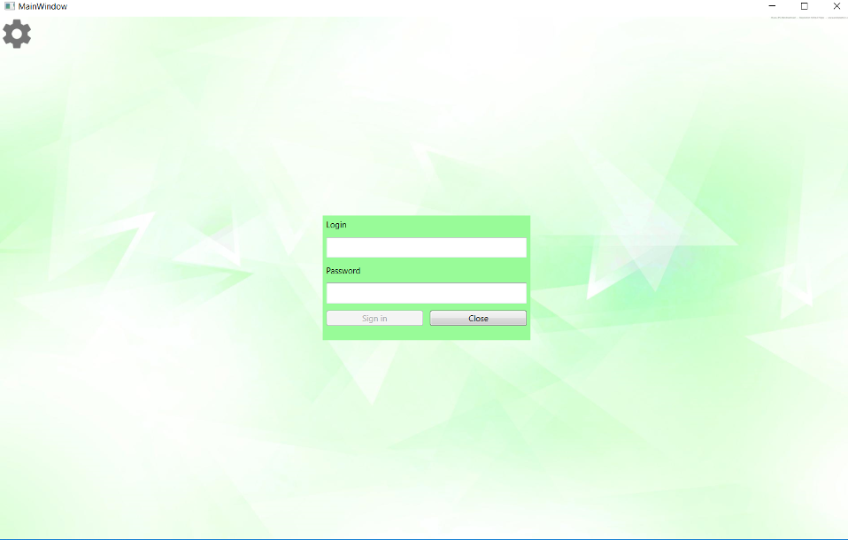
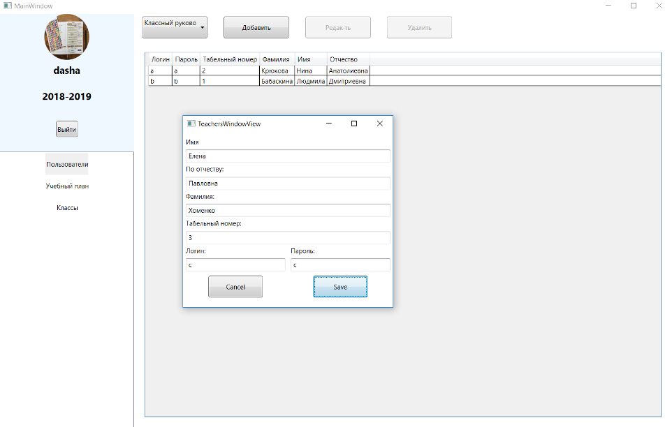
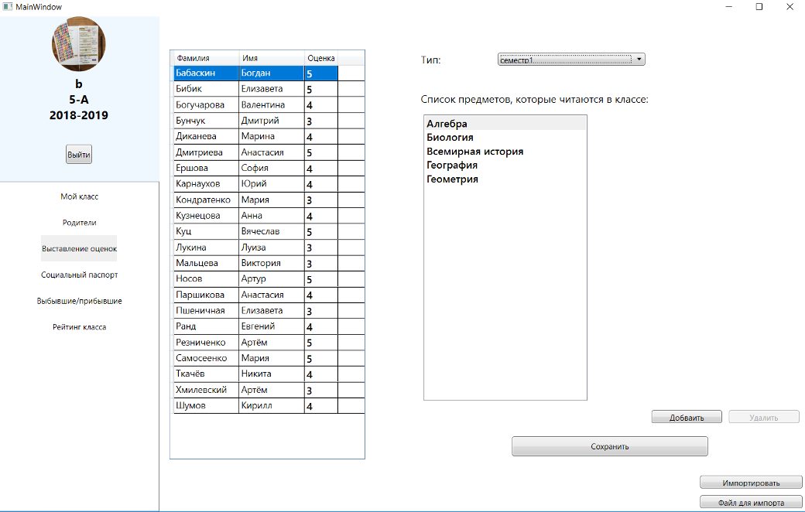
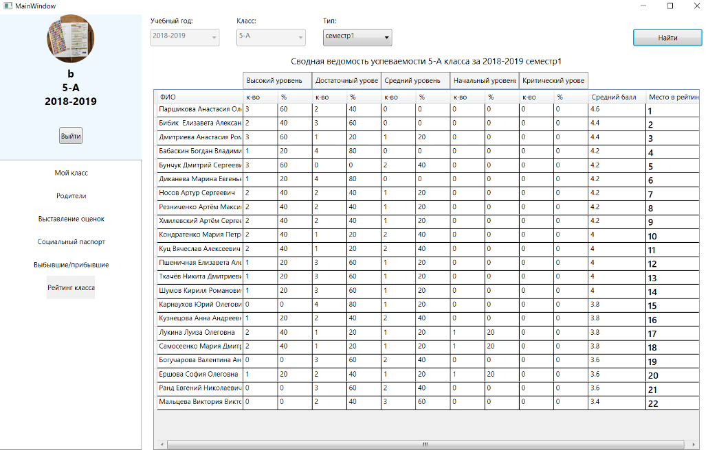
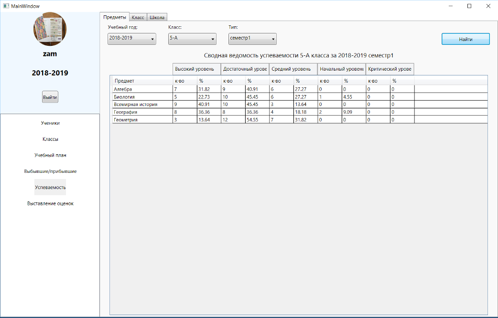

# School Journal

App for school students and grades management. Support several types of reports and aggregations.

### Stack

 - C#
 - WPF
 - SQL Server 
 - MVVM

### Interface
Login:

Managing teachers and access:

Putting grades for students:

Rating report in class:

Rating report by subject in class:

